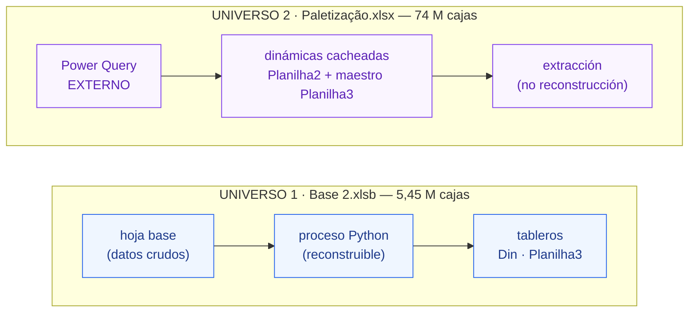
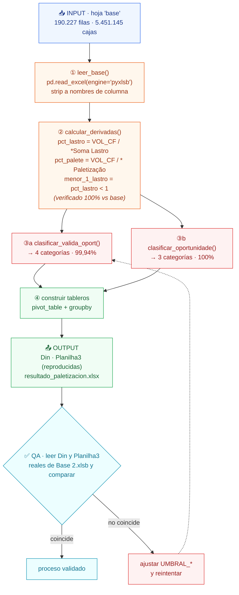
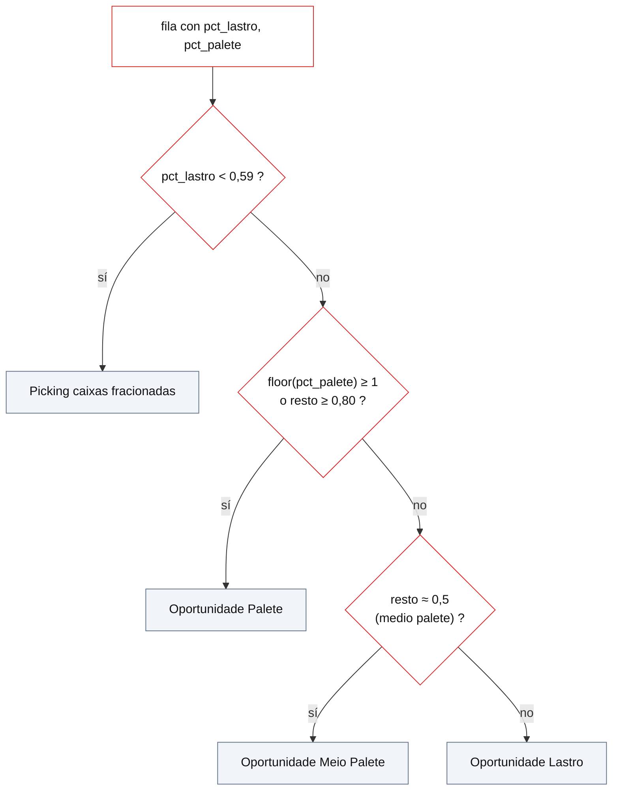
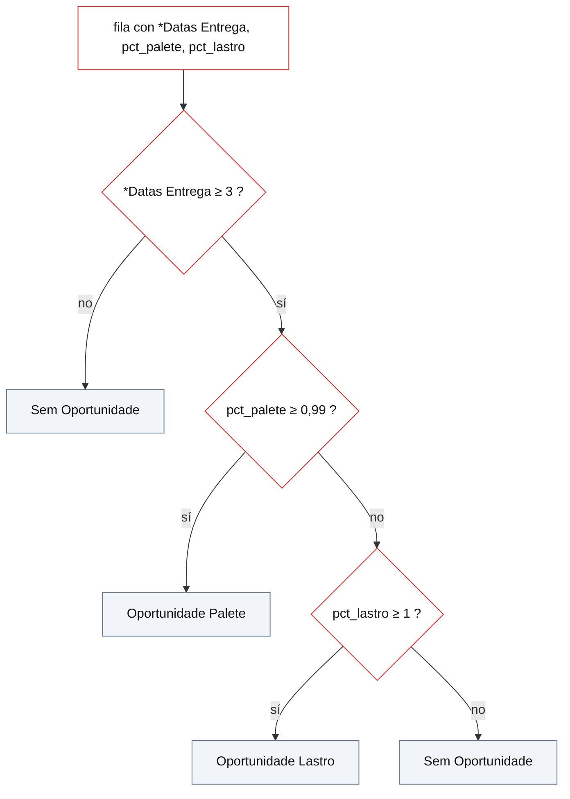
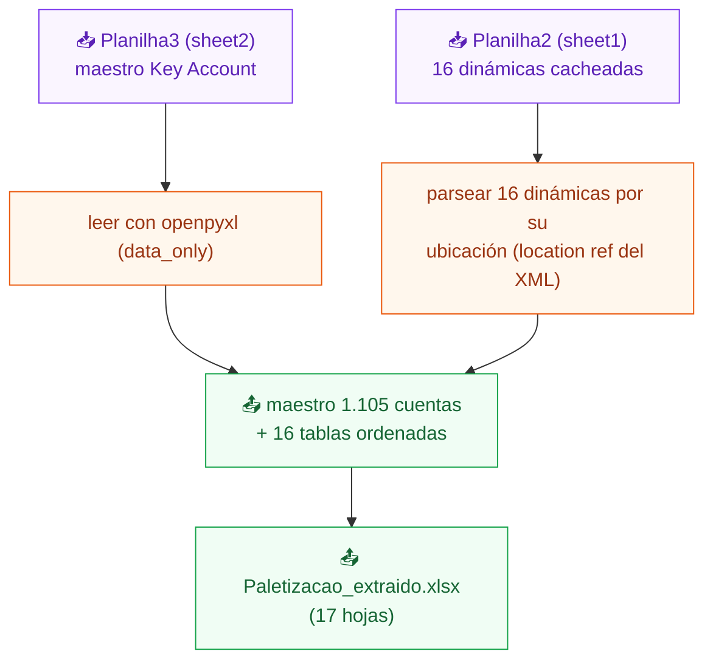

# Flujograma del Proceso — Análisis de Paletización
**KinAnalytics** · documentación técnica · input → proceso → output

---

## 0. Resumen en una frase

> A partir de datos de venta (sell-out) se calcula, para cada línea de pedido, **cómo se arma el volumen** (pallet / camada / cajas sueltas) y **si hay oportunidad de consolidarlo**, y luego se resume en tableros por oportunidad, canal, cadena y segmento.

Hay **dos universos de datos independientes**:

| # | Archivo | Alcance (VOL_CF) | ¿Tiene datos crudos? | Qué se puede hacer |
|---|---------|------------------|----------------------|--------------------|
| 1 | **`Base 2.xlsb`** → hoja `base` | **5.451.145** cajas · 190.227 filas | ✅ sí (hoja `base`) | **Reconstruir** todo el proceso en Python |
| 2 | **`Paletização.xlsx`** | **73.981.990** cajas | ❌ no (Power Query externo) | Solo **extraer** lo ya calculado |

---

## 1. INPUT — Entradas

### 1.1 Universo 1 · `Base 2.xlsb` → hoja **`base`** (fuente del proceso)

Una fila = **Mes × Canal × Cliente (Key account) × SKU × entrega**. 190.227 filas, 23 columnas.

**Columnas de entrada crudas** (lo que llega del sistema):

| Columna | Significado |
|---|---|
| `Nome do Mês` | Mes (abril, maio) |
| `Canal` | Atacadista, Hipermercado, Supermercado 5-19 / 20-49 CKS |
| `MATRICULA` · `Dupli. Matricula` | Código de cliente · marca de cliente distinto (1 = contar) |
| `Key account` | Cuenta / cadena minorista |
| `SKU_ECC` · `SKU_ECC_DESC` · `Categoria` | Producto y su categoría |
| `VOL_CF` | **Volumen vendido en cajas físicas** (métrica base) |
| ` LASTRO` · ` PALETIZACAO` | Cajas por camada · cajas por pallet completo (del maestro de producto) |
| `*Vol Misto` · `*Datas Entrega` | Volumen mixto · **nº de fechas de entrega** (clave para col18) |
| `*Soma Lastro` · `* Paletização` | Cajas por camada/pallet ajustadas por nº de entregas |
| `Camada` | Nº de camadas por pallet |

> ⚠️ `*Soma Lastro`, `* Paletização`, `*Datas Entrega` y `Camada` dependen de la agregación por fechas de entrega → se **toman como entrada** (no se recalculan fila a fila).

### 1.2 Universo 2 · `Paletização.xlsx` (fuente externa)

- **Sin datos crudos en el archivo.** Las 16 dinámicas se alimentan de **Power Query**:
  `Provider=Microsoft.Mashup.OleDb` → consultas **`Pre venda paletização`** (hechos) y **`DEPARA`** (maestro).
- `Planilha3` = **maestro de Key Accounts** (1.105 filas, dato real): `COD KEY ACCOUNT · Key account · GRUPO · SEGMENTO CUSTOMER · Canal · Subcanal`.
- `Planilha2` = **16 tablas dinámicas** ya calculadas (valores cacheados en celdas).

---

## 2. PROCESS — Proceso

### 2.1 Universo 1 · Pipeline reconstruible desde `base`

**Paso a paso (función por función):**

| Paso | Función | Entra | Hace | Sale |
|---|---|---|---|---|
| ① | `leer_base()` | `Base 2.xlsb` / `base` | lee el `.xlsb` con `pyxlsb`; normaliza nombres | `df` (190.227 × 23) |
| ② | `calcular_derivadas(df)` | `VOL_CF`, `*Soma Lastro`, `* Paletização` | divisiones seguras | `pct_lastro`, `pct_palete`, `menor_1_lastro` |
| ③a | `clasificar_valida_oport(df)` | `pct_lastro`, `pct_palete` | árbol de decisión (§2.2) | `valida_oport_palete` (4 cat.) |
| ③b | `clasificar_oportunidade(df)` | `pct_palete`, `pct_lastro`, `*Datas Entrega` | gate por entregas + umbrales | `oportunidade` (3 cat.) |
| ④ | `tablero_*()` | `df` clasificado | `pivot_table` / `groupby` | tableros (§3) |

### 2.2 Reglas de clasificación (los `IF` de Excel descifrados)

**③a · `valida_oport_palete` — 4 categorías** — con `resto = pct_palete − floor(pct_palete)`:

**③b · `oportunidade` — 3 categorías** — la oportunidad **solo existe si el SKU se recibió en ≥ 3 entregas** (consolidables):

### 2.3 Universo 2 · Extracción de `Paletização.xlsx`

No hay proceso de cálculo (la fuente es externa). El "proceso" es **leer y ordenar**:

---

## 3. OUTPUT — Salidas

### 3.1 Universo 1 · Tableros reproducidos (= hojas `Din` y `Planilha3` de `Base 2.xlsb`)

| Tablero | Dimensión × medida | Origen Excel |
|---|---|---|
| **Clientes por oportunidad** | `valida` × conteo de `Dupli.Matricula` | Planilha3 / Din bloque A |
| **Volumen por oportunidad** | `valida` × Σ `VOL_CF` (+ %) | Planilha3 bloque VOL |
| **Oportunidad × Canal** | `oportunidade` × `Canal` (conteo) | Din bloque B |
| **Oportunidad × Cadena/SKU** | `oportunidade` × `Key account` / `SKU` | Din bloques inferiores |
| **% de armado por REDE / Categoría** | `valida` × `VOL_CF` (% por fila) | Planilha3 heatmaps |

**Archivo generado:** `resultado_paletizacion.xlsx`.

### 3.2 Universo 2 · Extracción

- Maestro de **1.105 Key Accounts** (Planilha3).
- **16 dinámicas** de `Soma de VOL_CF` por `STATUS_PALLET_LASTRO`
  (LASTRO FECHADO · MISTO · PALLET FECHADO · LASTRO FRACIONADO), por SEGMENTO / Canal / GRUPO / Key account.
- **Archivo generado:** `Paletizacao_extraido.xlsx` (17 hojas).

---

## 4. QA — Validación (los otros datos solo comparan)

| Chequeo | Contra | Resultado |
|---|---|---|
| `pct_lastro` · `pct_palete` · `menor_1_lastro` | columnas cacheadas de `base` | **100%** |
| `oportunidade` (col18) — Din × Canal | hoja `Din` de `Base 2.xlsb` (en vivo) | **exacto · dif = 0** |
| `valida_oport_palete` (col22) | filas de `base` | **99,94%** |
| Volumen total | `Planilha3` de `Base 2.xlsb` | **5.451.145 = 5.451.145** |

Si un chequeo no coincide → se ajustan los `UMBRAL_*` y se reintenta (bucle de refinamiento).

---

## 5. Glosario y umbrales

| Término | Definición |
|---|---|
| `VOL_CF` | Volumen en cajas físicas (métrica base) |
| Lastro / Camada | Nivel horizontal de cajas dentro de un pallet |
| Pallet fechado | Pallet cerrado / completo de un mismo SKU |
| Fracionado / Picking | Cajas sueltas por debajo de una camada |
| `resto` | Parte fraccionaria de `pct_palete` (lo que sobra tras pallets enteros) |

| Umbral | Valor | Uso |
|---|---|---|
| `UMBRAL_LASTRO_MIN` | **0,59** | `pct_lastro <` → Picking |
| `UMBRAL_PALETE` | **0,80** | `resto ≥` → Palete |
| `UMBRAL_MEIO` | **≈0,50** | `resto ≈` → Meio Palete |
| `UMBRAL_OPORT_PALETE` | **0,99** | `pct_palete ≥` → Oportunidade Palete (col18) |
| `UMBRAL_DATAS` | **3** | `*Datas Entrega ≥` → habilita oportunidad (col18) |

---

*Documento generado por KinAnalytics. Diagramas en Mermaid (se renderizan en GitHub, VS Code y visores Markdown compatibles).*
